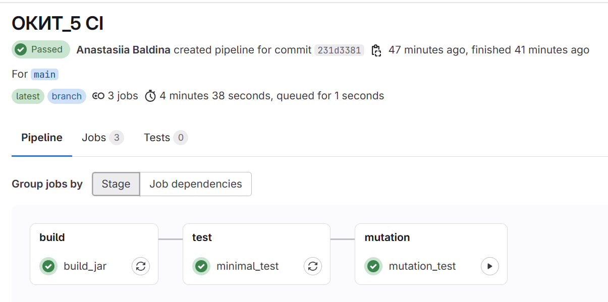
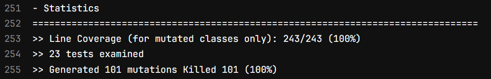

# ОКИТ HW7

Балдина Анастасия, БПИ235

- GitLab: `https://hseokitgitlab.ddns.net/Anastasiia-Baldina/testing-hw7`

## Что реализовано

- Git hook `commit-msg` с проверкой тега `ОКИТ_5` в сообщении коммита.
- GitLab CI pipeline с этапами:
  - `build_jar` (`./gradlew :shadowJar`)
  - `minimal_test` (`./gradlew test --tests '*Minimal'`)
  - `full_test` (`./gradlew test jacocoTestReport`) для MR
  - `publish_package` (публикация jar в GitLab Package Registry после успешных тестов)
  - `mutation_test` (`./gradlew :pitest`) ручной запуск на `main`
- Набор тестов расширен для прохождения mutation testing.
- Порог мутационного тестирования: `90%`.
- Фактический результат PIT: `100% (101/101)`.
- `full_test` и `publish_package` запускаются на `merge_request_event`.
- Артефакты pipeline:
  - `build/libs/*.jar`
  - `build/jacocoReport/test/html/`
  - `build/reports/pitest/`

## Структура CI

- Конфигурация pipeline: `.gitlab-ci.yml`
- Git hooks:
  - `.githooks/commit-msg`
  - `scripts/install-git-hooks.sh`

## Как запускать локально

```bash
./gradlew test
./gradlew :pitest
./gradlew :shadowJar
```

Для Windows:

```powershell
.\gradlew.bat test
.\gradlew.bat :pitest
.\gradlew.bat :shadowJar
```

## Скриншоты





